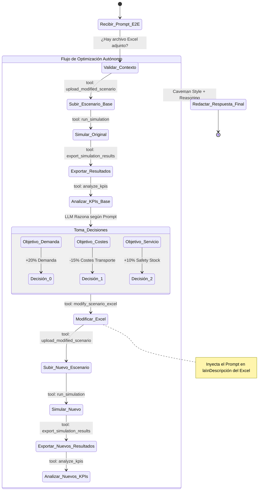

# Diagrama Lógico del Flujo de Optimización (E2E)

```mermaid
stateDiagram-v2
    [*] --> Recibir_Prompt_E2E
    
    Recibir_Prompt_E2E --> Validar_Contexto: ¿Hay archivo Excel adjunto?
    
    state "Flujo de Optimización Autónomo" as OptFlow {
        Validar_Contexto --> Subir_Escenario_Base: tool: upload_modified_scenario
        Subir_Escenario_Base --> Simular_Original: tool: run_simulation
        Simular_Original --> Exportar_Resultados: tool: export_simulation_results
        Exportar_Resultados --> Analizar_KPIs_Base: tool: analyze_kpis
        
        Analizar_KPIs_Base --> Toma_Decisiones: LLM Razona según Prompt
        
        state Toma_Decisiones {
            direction TB
            Objetivo_Demanda --> Decisión_0: +20% Demanda
            Objetivo_Costes --> Decisión_1: -15% Costes Transporte
            Objetivo_Servicio --> Decisión_2: +10% Safety Stock
        }
        
        Toma_Decisiones --> Modificar_Excel: tool: modify_scenario_excel
        note right of Modificar_Excel: Inyecta el Prompt en la\nDescripción del Excel
        
        Modificar_Excel --> Subir_Nuevo_Escenario: tool: upload_modified_scenario
        Subir_Nuevo_Escenario --> Simular_Nuevo: tool: run_simulation
        Simular_Nuevo --> Exportar_Nuevos_Resultados: tool: export_simulation_results
        Exportar_Nuevos_Resultados --> Analizar_Nuevos_KPIs: tool: analyze_kpis
    }
    
    OptFlow --> Redactar_Respuesta_Final: Caveman Style + Reasoning
    Redactar_Respuesta_Final --> [*]
```
