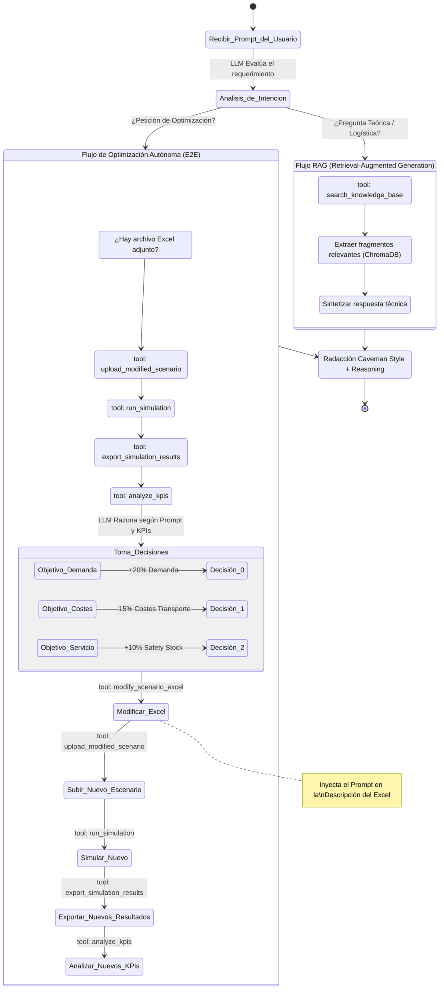

# Diagrama Lógico Completo del Agente (Optimización E2E + RAG)

### Explicación para tu TFG
1. **El Enrutador (Análisis de Intención):** Al recibir un mensaje, el LLM decide autónomamente si debe usar sus herramientas de lectura de base de datos (RAG) o sus herramientas de interacción con la API de AnyLogistix. 
2. **Capacidad Híbrida:** El agente es capaz de mezclar ambos flujos en un solo turno. Si el usuario pide *"Explícame qué es el Safety Stock y luego optimiza este archivo para mejorarlo"*, el agente pasará primero por el bloque RAG para buscar la definición, y luego saltará al bloque de optimización para aplicar el Excel, demostrando un uso avanzado de herramientas combinadas.
